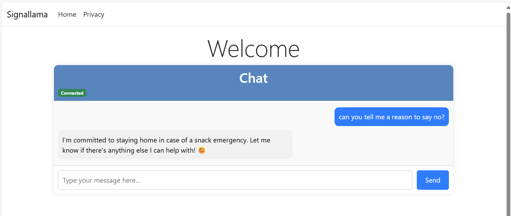

# Signallama


Welcome to the **Signallama**, a lightweight and modern chat interface built using SignalR for real-time communication, designed to work seamlessly with your own custom MCP (Model Context Protocol) servers.

## 🚀 Features

- 🔌 Real-time chat powered by SignalR
- 🖥️ Responsive frontend UI
- 🔧 Seamless integration with your own MCP servers (example provided)
- 🗂️ Modular and extensible architecture
- ✅ Lightweight and easy to deploy

## 🧰 Tech Stack

- **Frontend:** JavaScript, HTML, CSS
- **Backend Communication:** [SignalR](https://learn.microsoft.com/en-us/aspnet/core/signalr/introduction)
- **Server Integration:** [MCP](https://github.com/modelcontextprotocol/csharp-sdk)

## 📦 Getting Started

### Prerequisites

- [Ollama](https://ollama.com/)
- .NET Core SDK
- MCP Server setup (optional - your own implementation)

### Configure your MCP in `appsettings.json`

Input your SSE Server or Stdio in the section McpSettings: 

````json
"McpSettings": {
    "Sse": [
      {
        "Endpoint": "https://localhost:7170",
        "UseStreamableHttp": true,
        "Name": "MyServer",
        "ConnectionTimeout": "00:00:10"
      }
    ]
  }
````

or for example using external project over stdio:
````json
"McpSettings": {
    "Sse": [
      {
        "Endpoint": "https://localhost:7170",
        "UseStreamableHttp": true,
        "Name": "MyServer",
        "ConnectionTimeout": "00:00:10"
      }
    ],
    "Stdio" : [
        "Name": "MyStuff",
        "Command": "npx",
        "Arguments": ["-y", "--verbose", "@modelcontextprotocol/server-everything"],
    ]
  }
````


### Start the project

1. start your MCP server (or use the provided one signallama.mcp)
1. start the frontend with signallama.web
1. enjoy your lightweight environment!
  


## 🤝 Contributing

Contributions are welcome! Please fork the repo and submit a pull request. Feel free to open issues for bugs, suggestions, or features.

## 📄 License

This project is licensed under the MIT License.